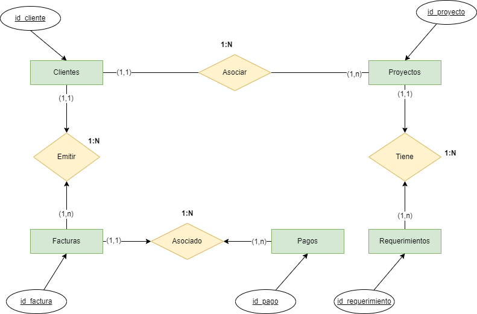

# dsrp-contabilidad-consultoria

Caso de Estudio: Diseño de la Base de Datos para la Contabilidad de una Empresa de Consultoría de Negocios

## Introducción
Este caso de estudio detalla el diseño de una base de datos para una empresa de consultoría de negocios. La base de datos tiene como objetivo gestionar la contabilidad de la empresa, rastreando proyectos, **clientes**, facturas, y requerimientos, entre otros elementos clave. El sistema está diseñado para optimizar la gestión de la información financiera y administrativa, asegurando la precisión y disponibilidad de los datos para la toma de decisiones.

## Requisitos del Sistema

La base de datos debe cumplir con los siguientes requisitos:

* Gestión de Clientes: La base de datos debe almacenar información detallada sobre los clientes, quienes son personas jurídicas (empresas) en Perú.
* Gestión de Proyectos: Cada proyecto está asociado a un cliente específico y puede tener múltiples requerimientos.
* Gestión de Requerimientos: Los requerimientos están ligados a proyectos y deben ser rastreados para asegurar su cumplimiento.
* Gestión de Facturación: La base de datos debe rastrear las facturas emitidas a los clientes por los servicios prestados, incluyendo detalles como el monto, la fecha de emisión, y el estado de la factura.
* Otras Consideraciones: La base de datos debe ser escalable, segura y optimizada para consultas rápidas y precisas.

## Diagrama Entidad Relación

## Modelo de Datos Propuesto

A continuación, se detalla el modelo de datos propuesto, incluyendo las tablas principales y sus campos.

1. Tabla Clientes
    Esta tabla almacena información sobre los clientes, que son empresas en Perú.

    Campos:

    id_cliente (INT, PK, AI): Identificador único del cliente.  
    ruc (VARCHAR(11), UNIQUE): Número de RUC del cliente.  
    razon_social (VARCHAR(255)): Razón social del cliente.  
    direccion (VARCHAR(255)): Dirección fiscal del cliente.  
    telefono (VARCHAR(15)): Teléfono de contacto del cliente.  
    email_contacto (VARCHAR(255)): Correo electrónico de contacto.  
    fecha_registro (DATE): Fecha en la que el cliente fue registrado.  

2. Tabla Proyectos
Esta tabla almacena información sobre los proyectos que la empresa de consultoría realiza para sus clientes.
Campos:

    id_proyecto (INT, PK, AI): Identificador único del proyecto.  
    id_cliente (INT, FK): Identificador del cliente al que pertenece el proyecto.  
    nombre_proyecto (VARCHAR(255)): Nombre del proyecto.  
    descripcion_proyecto (TEXT): Descripción detallada del proyecto.  
    fecha_inicio (DATE): Fecha de inicio del proyecto.  
    fecha_fin (DATE): Fecha de finalización del proyecto.  
    estado (ENUM('Pendiente', 'En Proceso', 'Completado')): Estado actual del proyecto.  

    Relación:

    Clientes -> Proyectos: Relación de uno a muchos (Un cliente puede tener múltiples proyectos).

3. Tabla Requerimientos
Esta tabla almacena los requerimientos específicos para cada proyecto.

    Campos:

    id_requerimiento (INT, PK, AI): Identificador único del requerimiento.  
    id_proyecto (INT, FK): Identificador del proyecto al que pertenece el requerimiento.  
    descripcion_requerimiento (TEXT): Descripción del requerimiento.  
    fecha_solicitud (DATE): Fecha en la que se solicitó el requerimiento.  
    fecha_entrega (DATE): Fecha en la que se entregó el requerimiento.  
    estado (ENUM('Pendiente', 'En Proceso', 'Completado')): Estado actual del requerimiento.  

    Relación:

    Proyectos -> Requerimientos: Relación de uno a muchos (Un proyecto puede tener múltiples requerimientos).

4. Tabla Facturas
Esta tabla gestiona las facturas emitidas a los clientes.

    Campos:

    id_factura (INT, PK, AI): Identificador único de la factura.  
    id_cliente (INT, FK): Identificador del cliente al que se emitió la factura.  
    numero_factura (VARCHAR(20), UNIQUE): Número de factura.  
    fecha_emision (DATE): Fecha de emisión de la factura.  
    fecha_vencimiento (DATE): Fecha de vencimiento de la factura.  
    monto_total (DECIMAL(10, 2)): Monto total de la factura.  
    estado_pago (ENUM('Pendiente', 'Pagado', 'Vencido')): Estado del pago de la factura.  

    Relación:

    Clientes -> Facturas: Relación de uno a muchos (Un cliente puede tener múltiples facturas).

5. Tabla Pagos
Esta tabla almacena la información de los pagos realizados por los clientes.

    Campos:

    id_pago (INT, PK, AI): Identificador único del pago.  
    id_factura (INT, FK): Identificador de la factura que se está pagando.  
    fecha_pago (DATE): Fecha en que se realizó el pago.  
    monto_pagado (DECIMAL(10, 2)): Monto del pago realizado.  
    metodo_pago (ENUM('Transferencia', 'Cheque', 'Efectivo')): Método de pago utilizado.  

    Relación:

    Facturas -> Pagos: Relación de uno a muchos (Una factura puede tener múltiples pagos asociados).

## Diagrama Entidad-Relación (ERD)
Un diagrama ERD representaría las tablas mencionadas y sus relaciones. Las entidades principales (Clientes, Proyectos, Requerimientos, Facturas, Pagos) están interrelacionadas para garantizar la integridad y consistencia de los datos.

## Conclusión
El diseño propuesto proporciona una base sólida para gestionar la contabilidad y otros aspectos administrativos de una empresa de consultoría de negocios. Este modelo relacional permite una gestión eficiente y escalable, con un enfoque en la integridad y precisión de los datos, fundamentales para la toma de decisiones en un entorno empresarial dinámico.

